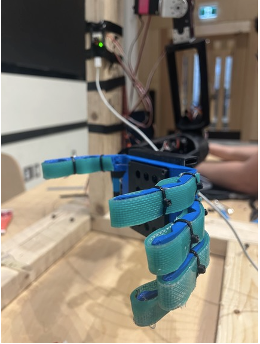
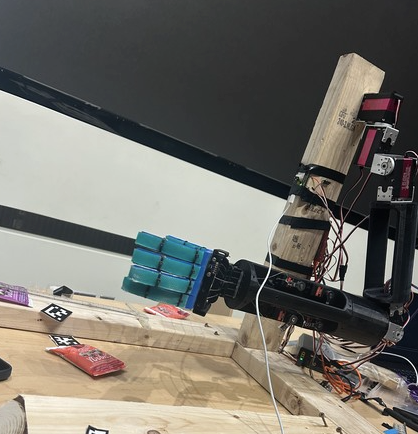
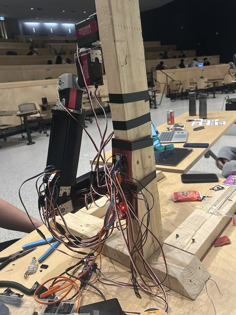

# Robot-Arm
## Inspiration  
Many individuals who have lost the ability to use their hands face daily challenges in performing basic tasks, impacting their independence and quality of life. We wanted to build a solution that **empowers users through technology**, allowing them to interact with their environment effortlessly. Inspired by advancements in **AI, robotics, and assistive devices**, we developed **Helping Hand**—a bionic arm that responds to **voice commands and visual input**, enabling users to grasp objects intuitively.  

## What it does  
Helping Hand is an **AI-powered bionic arm** that combines **speech recognition and computer vision** to assist users in picking up and interacting with objects. Users can simply **say a command** like *"Pick up the red ball,"* and the arm will **identify, approach, and grasp the object intelligently**—pinching small items or gripping larger ones. This allows for **seamless and adaptive control**, enhancing accessibility for individuals with limited mobility.  

## How we built it  
- **Speech Recognition:** Processes voice commands to understand user intentions.  
- **Computer Vision:** Uses object detection to identify and classify items in front of the arm.  
- **AI-Powered Grasping:** Determines whether to **grip with all fingers** or **pinch with two**, based on the object's size and shape.  
- **Hardware Integration:** Powered by **servo motors, embedded microcontrollers, and machine learning models** for smooth, adaptive movement.  

## Challenges we ran into  
- **Real-Time Processing:** Synchronizing **speech input with visual recognition** required optimizing performance for speed and accuracy.  
- **Object Detection Accuracy:** Training the model to correctly identify and distinguish objects in **varying lighting and backgrounds** was challenging.  
- **Grip Precision:** Ensuring that the arm **grasps objects securely without dropping or crushing them** required fine-tuning.  

## Accomplishments that we're proud of  
- Successfully **integrated AI-driven speech and vision** for natural interaction.  
- Developed an adaptive **grasping mechanism** that adjusts based on object properties.  
- Built a working prototype that demonstrates **real-time object detection and response**.  

## What we learned  
- Gained hands-on experience in **computer vision, speech recognition, and robotics integration**.  
- Improved our understanding of **human-centered design** for assistive technology.  
- Learned how to **optimize AI models** for real-time applications.  

## What's next for Helping Hand  
- **Enhanced Object Recognition:** Improving accuracy with **better training datasets and edge-case handling**.  
- **Customizable User Preferences:** Allowing users to fine-tune grip strength and response settings.  
- **Wireless and Wearable Design:** Exploring ways to make the arm **lighter, more comfortable, and fully wireless**.  
- **Integration with Smart Home Devices:** Enabling Helping Hand to interact with **voice assistants and home automation systems**.  

### Images

## Demo Video

